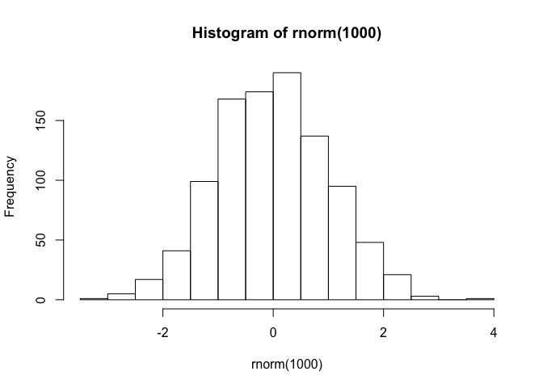

Notebook
================
Me
5/14/2019

Jessie's Notebook
=================

Day 2 - R Module
----------------

The Summer Course started yesterday. We:

-   Ran over introductions
-   Island Tour
-   Students went shopping

[Here is a helpful website for equations](https://www.calvin.edu/~rpruim/courses/s341/S17/from-class/MathinRmd.html)

Here is a cool picture of Coconut Island.


Here is a formula that is interesting:

$$ x^2 = \\frac{y^2}{z^2} $$

``` r
hist(rnorm(1000))
```



> Figure 1: Histogram of ant heights

Today, we are doing an R Module. We learned:

-   How to create a Markdown
-   How to connect R to GitHub
-   How to commit and push files to GitHub
-   What GitHub allows us to do
-   Many, many more amazing ways to use R Markdown and Git & GitHub

Very trying morning. Here we are.
